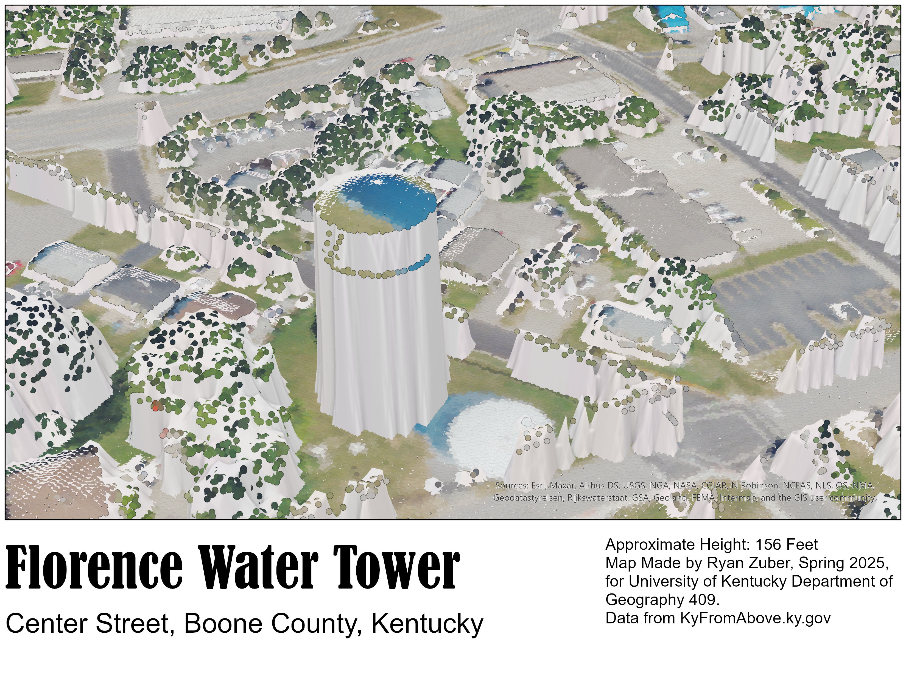
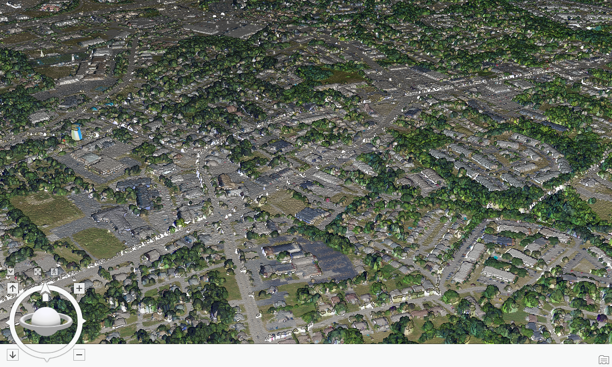

# Florence-Water-Tower

My Feature is the Water Tower in Florence, Kentucky. This feature is right next to the downtown of Florence, and the height of this Water Tower is around 156 feet. There is also animation of downtown Florence showing a colorized point cloud, dem, and dsm layer. The data is from KyFromAbove.ky.gov

  
_Approximate Height: 156 Feet, Data from KyFromAbove.ky.gov_

  
_[Ariel view of Florence, Kentucky Downtown]

Animation of Florence, Keutcky Downtown
([https://www.youtube.com/watch?v=nFV8ftGN0aM](https://youtu.be/ry6cP2zVr-Y))_
